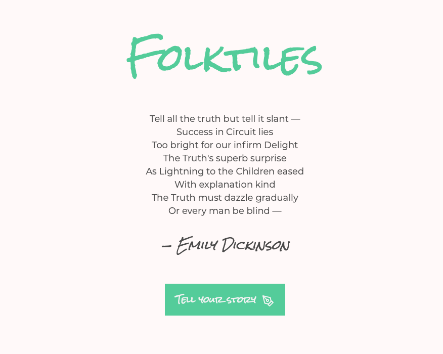

# Innovation & The Unknown
## Third year Ravensbourne UX/UI Design degree project

# Folktiles

Folktiles uses sentiment recognition from user submitted text to create a data-representation. This data representation (or data-tile, as I call them) is then written to a database, along with it's associated data. It can then be viewed alongside all other stories and tiles within a single UI. 

The entire Folktiles project lives within the /main directory, other folders contain experiments in sentiment recognition algorithms and data visualisation.
## Main Functions

Folktiles can be thought of as three component functions: 
1. Sentiment Recognition (Tensorflow.js)
2. Data Visualisation (D3.js)
3. Writing to/Reading from a database (MongoDB)
### 1. Sentiment Recognition

Folktiles uses a pre-trained moder

1. Filepath: main/pages/create_tile/index.js

2. Filepath: main/components/create_tile/AnalyseText.js