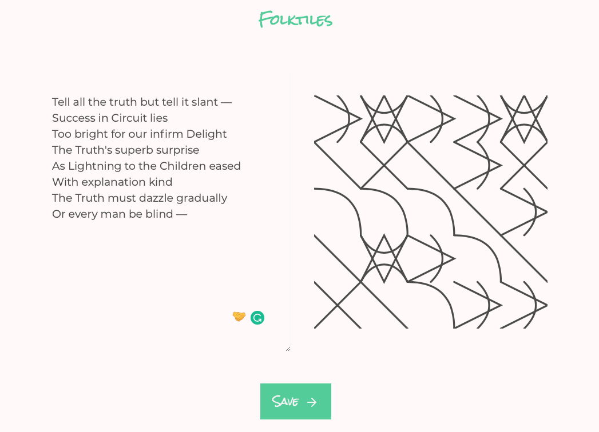
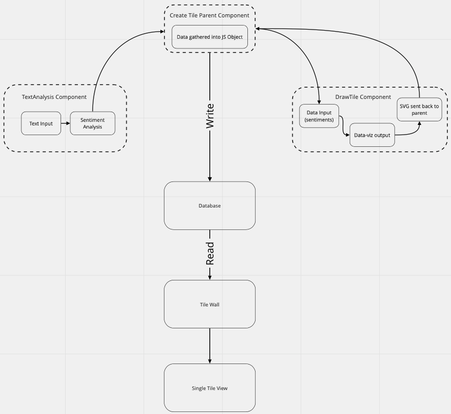
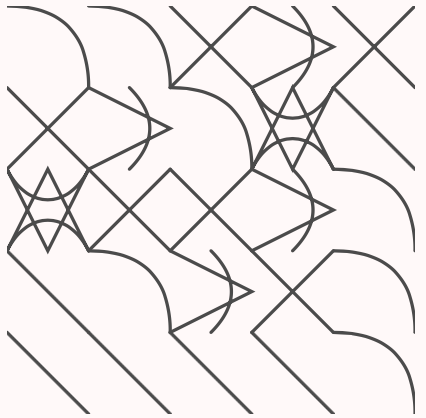
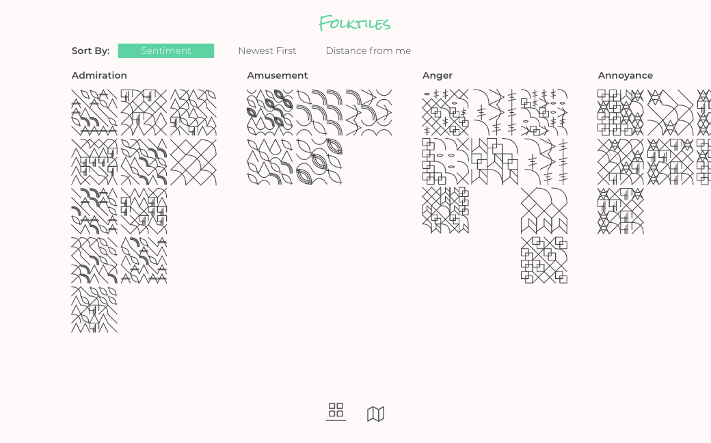
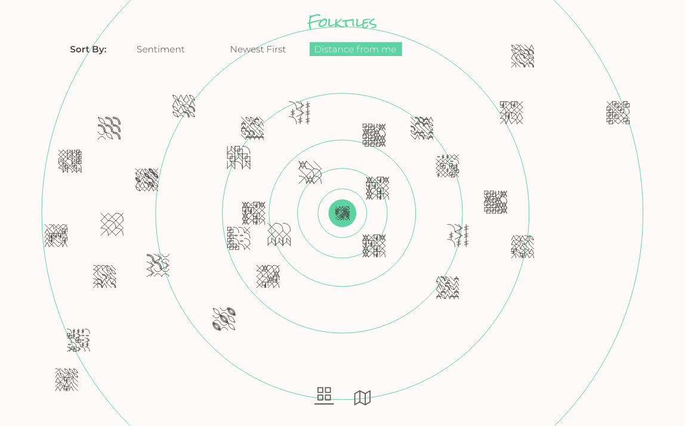
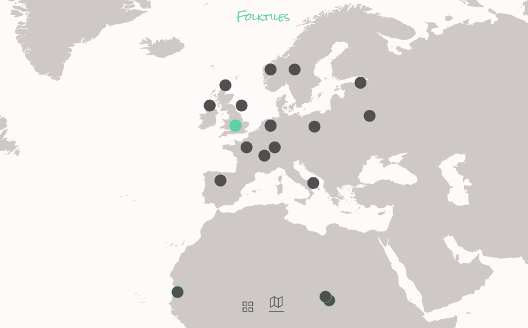
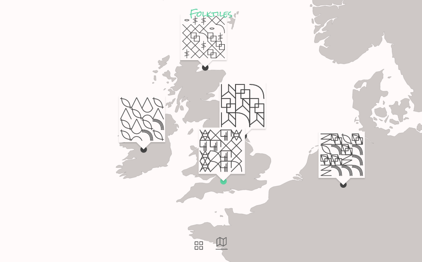

# Innovation & The Unknown
## Third year Ravensbourne UX/UI Design degree project

# Folktiles

Folktiles uses sentiment recognition (using Tensoflow.js) from user submitted text to create a data-representation (D3.js). This data representation (or data-tile, as I call them) is then written to a database (MongoDB), along with it's associated data. It can then be viewed alongside all other stories and tiles within a single UI. 

The  Folktiles project is built upon Next.js, it lives within the /main directory. Other folders contain experiments in sentiment recognition algorithms and data visualisation.

## Main Functions

Folktiles can be thought of as three component functions: 

1. Sentiment Recognition (Tensorflow.js)
The data returned from this is the passed to:

2. Data Visualisation (D3.js)
Which is then saved: 

3. Writing to/Reading from a database (MongoDB)

### 1. Sentiment recognition

Folktiles uses a pre-trained model (to generate this model see /text-in-emotion-model-generator)

#### 1. Filepath: main/pages/create_tile/index.js
This file contains the parents component for both sentiment recognition, and the data-representation generated

#### 2. Filepath: main/components/create_tile/AnalyseText.js
AnalyseText is the component into which the user inputs the text, and from which is returned the sentiment analysis. The text is passed into a Tensorflow.js function that returns an array of 27 values, each value corresponding to an emotion. The value is a number between 0 and 1, with 1 being the strongest possible recognition of that emotion. 
This data is then passed up to the parent component, and passed down to the DrawTiles component, that creates the data-representation using D3.js.

### 2. Draw the data-representation

#### Filepath : main/components/create_tile/DrawTiles.js
This components receives the data from the sentiment recognition algorithm. 
Each of the possible 27 emotions has an associated SVG shape. 
We create a matrix, the length of each axis is equal to the number of non-zero sentiment values, up to a maximum of five. 
This matrix is used to create a visualisation, upon each point a random shape that matches one of the recognised sentiments is chosen for that point. This shape is then drawn at the appropriate point for its index within the canvas. 
The result is a series of shapes that respond to the emotions present in a piece of text in a semi-random sense. And there is an increase in complexity with increased complexity in the data. 

### 3. Write/Read from the database

#### 1.Filepath: main/pages/create_tile/index.js
When the user clicks the save button, the SVG is gathered from within the DrawTile component and along with the text and sentiment recognition data is sent to an API endpoint. This endpoint is built with the Next.js server api.
#### 2.Filepath: main/api/push_tile.js
push_tile.js consumes the request body and sends it to MongoDB

#### 3. Filepath: main/pages/tile_wall.js
The MongoDB database in which the data is stored is read on initial load using GetServerSideProps, this data is then visualised on screen in chronological order (newest first).

## Thinking Further
This is a proof of a concept, but the concept itself expands beyond what I've built here.
The data-representations are displayed chronologically on the live site, but the project involved further possibilties. 

