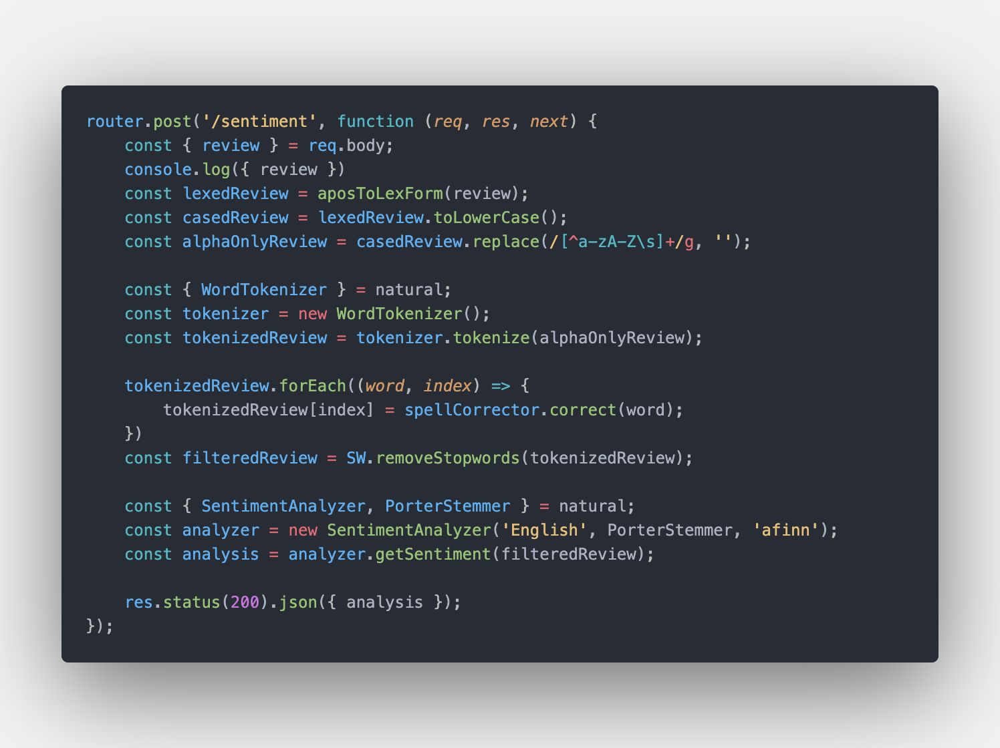

# Sentiment Analysis

[View the project here](https://iatu-sentiment-analysis.glitch.me)

A simple express app that analyses the sentiment in a typed piece of text, built following [this tutorial](https://blog.logrocket.com/sentiment-analysis-node-js/) from Ebenezer Don.

Built to test the best ways of gathering emotional data from a user provided piece of text

