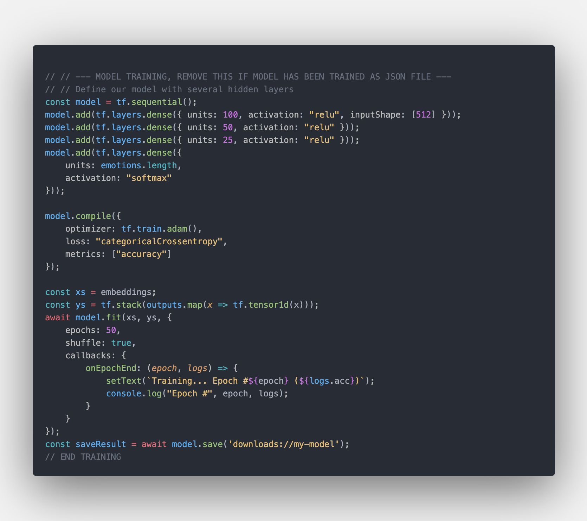
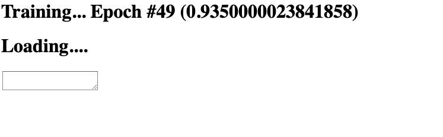

# Train the tensorflow model

This code generates a Tensorflow.js model that recognises emotional sentiment in text. 
Created by following this [tutorial by Raphael Mun.](https://www.codeproject.com/Articles/5282690/AI-Chatbots-With-TensorFlow-js-Improved-Emotion-De)

The model is trained using the GoEmotion dataset from Google Research.
'GoEmotions is a corpus of 58k carefully curated comments extracted from Reddit, with human annotations to 27 emotion categories or Neutral.' - [Source](https://github.com/google-research/google-research/tree/master/goemotions)

The model will begin training once the page has loaded, the model is then saved as a JSON file to your downloads folder. 

The model can then be run immediately. 

### Using the model
This project already contains a trained model for you to use, but will still generate one automatically when loaded.
After the model has been generated it will save to your downloads folder.

To prevent the model being auto-generated and only have results generated on input, follow instructions outlined in the code as to which area to remove. 

